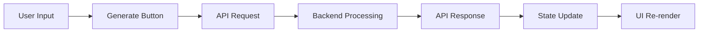

# Frontend Architecture and Guidelines: Svelte MVP Roadmap Generator

## 1. Overview

The Svelte frontend is built using SvelteKit, providing a component-based architecture for interacting with our AI-powered roadmap generation backend. Key characteristics:

- **Component-driven development** for maintainability and reusability
- **Reactive state management** through Svelte stores and props
- **Progressive enhancement** strategy using Melt UI components
- **API-first approach** for integration with Node.js backend services
- **Tailwind CSS** for consistent styling and responsive design. I am using the tailwind css v4
- **No usage of SvelteKit's built-in backend features**; instead, communicate with our custom Node.js/Express backend via API calls. It runs on a local dev server port 3000.

## 2. Component-Based Architecture

### Core Components

**`src/routes/+page.svelte` (Main Page)**

- Handles user input through textarea element
- Manages API communication via axios
- Displays raw JSON output (temporary implementation)
- Orchestrates loading states and error handling

### Future Component Roadmap

| Component                    | Responsibility                           |
| ---------------------------- | ---------------------------------------- |
| `RoadmapDisplay.svelte`      | Structured visualization of roadmap data |
| `LoadingIndicator.svelte`    | Animated loading states for API calls    |
| `ErrorMessage.svelte`        | Consistent error presentation            |
| `ConversationManager.svelte` | Handle follow-up questions and context   |

## 3. Data Flow



Key data points:

- `ideaDescription`: User input text
- `conversationId`: Session identifier for follow-up questions
- `roadmapOutput`: Processed JSON from backend

## 4. Melt UI Integration

```bash
npm install @melt-ui/svelte @melt-ui/recipes
```

Implementation Strategy:

1. Use Shadcn Svelte UI for consistent design and styling
2. Implement accessible loading states using Melt transitions
3. Style roadmap output using Melt's composable primitives
4. Maintain theme consistency through CSS variables

## 5. Future Enhancements

- **Interactive Visualization**: Implement D3.js integration for roadmap timelines
- **State Management**: Introduce Svelte stores for complex state scenarios
- **Authentication**: Add OAuth flow for user persistence
- **Testing**: Implement Cypress component testing
- **Performance**: Add lazy loading for roadmap visualization components

## 6. Paths

- `Utils` $lib/utils
- `Components` $lib/components
